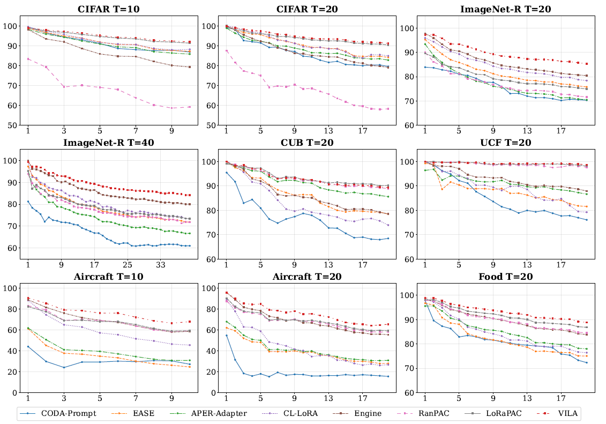
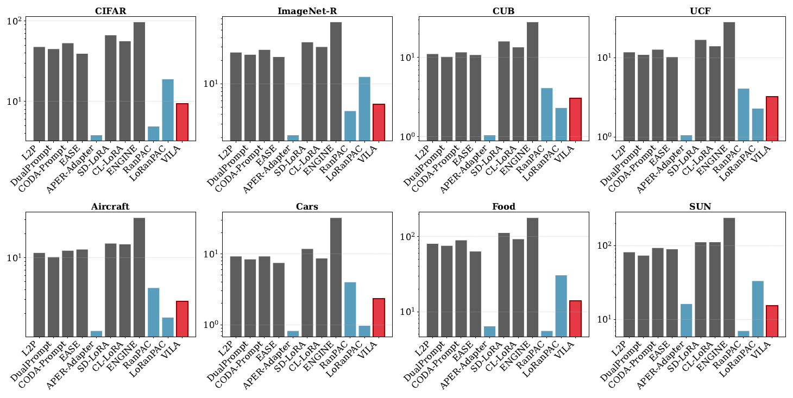

# VILA: Vision-Language Analytic Learning for Class-Incremental Learning

<p align="center">
  <a href=""></a>
  <a href='https://arxiv.org/abs/2309.07117'></a>
  <a href=""></a>
  <a href="https://hits.sh/github.com/byzhaoAI/VILA/"></a>
  <a href=""></a>
  <a href=""></a>
</p>


<p align="center">
  <a href="#-introduction"> 🎉Introduction</a> •
  <a href="#-updates"> 📌Updates</a> •
  <a href="#-datasets-supported"> 🌈Datasets Supported </a> •
  <a href="#-methods-supported"> 📋Methods Supported </a>
  <br />
  <a href="#-get-started"> 📖Get Started </a> •
  <a href="#-reproduced-results"> 📊Reproduced Results </a> •
  <a href="#️-citation"> 🏷️Citation </a> •
  <a href="#-contact"> 🤝Contact </a> •
  <a href="#-acknowledgments"> 🙏Acknowledgments </a>
</p>


---

## 🎉 Introduction
This is the official PyTorch implementation of **VILA** <a href="https://arxiv.org/abs/">[Arxiv]</a>, a novel dual-branch framework that addresses representation rigidity in pretrained model (PTM) based analytic class-incremental learning (CIL). 

VILA integrates a task‑adapted Vision Transformer with a frozen vision‑language model via geometric feature alignment (UGC) and semantic decision calibration (CSE). It leverages recursive least squares updates to achieve mathematically optimal weights with zero forgetting, consistently outperforming iterative methods across diverse benchmarks with higher training efficiency.


## 📌 Updates
- [2026/02] Initial version of VILA is released.


### 🌈 Datasets Supported

- `CIFAR100`: will be automatically downloaded by the code.
- `ImageNet-R`: Google Drive: [link](https://drive.google.com/file/d/1SG4TbiL8_DooekztyCVK8mPmfhMo8fkR/view?usp=sharing) or Onedrive: [link](https://entuedu-my.sharepoint.com/:u:/g/personal/n2207876b_e_ntu_edu_sg/EU4jyLL29CtBsZkB6y-JSbgBzWF5YHhBAUz1Qw8qM2954A?e=hlWpNW)
- `CUB`:  Google Drive: [link](https://drive.google.com/file/d/1XbUpnWpJPnItt5zQ6sHJnsjPncnNLvWb/view?usp=sharing) or Onedrive: [link](https://entuedu-my.sharepoint.com/:u:/g/personal/n2207876b_e_ntu_edu_sg/EVV4pT9VJ9pBrVs2x0lcwd0BlVQCtSrdbLVfhuajMry-lA?e=L6Wjsc)
- `UCF`: Google Drive: [link](https://drive.google.com/file/d/1Ng4w310_VDqpKbc7eYaumXTOiDxI02Wc/view?usp=sharing) or OneDrive: [link](https://njuedu-my.sharepoint.cn/:u:/g/personal/ky2409911_365_nju_edu_cn/EU2qHQXjASdLh1jIl6ihZmcB6G2KvqmSw-sTlZKDE6xPbg?e=7ezvTr)
- `Aircraft`: Google Drive: [link](https://drive.google.com/file/d/1xI5r1fU0d6Nff51HuOo5w-e4sGEP46Z2/view?usp=drive_link) or OneDrive: [link](https://njuedu-my.sharepoint.cn/:u:/g/personal/ky2409911_365_nju_edu_cn/ETVliZnmPY9AvZZgcFFJ6jMB2c7TRvcq7-gso2Aqvdl_VQ?e=pWXqdP)
- `Cars`: Google Drive: [link](https://drive.google.com/file/d/1D8ReAuOPenWi6SMNUrOZhbm6ViyhDHbL/view?usp=sharing  ) or OneDrive: [link](https://njuedu-my.sharepoint.cn/:u:/g/personal/ky2409911_365_nju_edu_cn/EbT1XAstg51Mpy82uHM0D2EBJLrtzmr_V64jeBRjqyyTnQ?e=h6g1rM)
- `Food`: Google Drive: [link](https://drive.google.com/file/d/1rupzXpwrbxki4l-RVmsRawhz1Cm0lDY5/view?usp=drive_link) or OneDrive: [link](https://njuedu-my.sharepoint.cn/:u:/g/personal/ky2409911_365_nju_edu_cn/Eb4xfptD4L5Egus-SiYxrIcBDH1VewLGp4kzyACGF_Na_w?e=duA3Ia)
- `SUN`: OneDrive: [link](https://njuedu-my.sharepoint.cn/:u:/g/personal/ky2409911_365_nju_edu_cn/EcQq1-1pFulKstYtdknB4O8BGo0hnlDRarAwB4wFEgkx0Q?e=YZ0xYV)

> These subsets are sampled from the original datasets. Please note that I do not have the right to distribute these datasets. If the distribution violates the license, I shall provide the filenames instead.

When training **not** on `CIFAR100`, you should specify the folder of your dataset in `utils/data.py`.

```python
    def download_data(self):
        "You should specify the folder of your dataset"
        train_dir = '[DATA-PATH]/train/'
        test_dir = '[DATA-PATH]/val/'
```


## 📋 Methods Supported

These methods are implemented in the [`exps/`](exps/) directory:

- `FineTune`: Baseline method which simply updates parameters on new tasks.
- `iCaRL`: CVPR 2017 [[paper](https://arxiv.org/abs/1611.07725)]
- `Coil`: ACM MM 2021 [[paper](https://arxiv.org/abs/2107.12654)]
- `DER`: CVPR 2021 [[paper](https://arxiv.org/abs/2103.16788)]
- `FOSTER`: ECCV 2022 [[paper](https://arxiv.org/abs/2204.04662)]
- `L2P`: CVPR 2022 [[paper](https://arxiv.org/abs/2112.08654)]
- `DualPrompt`: ECCV 2022 [[paper](https://arxiv.org/abs/2204.04799)]
- `MEMO`: ICLR 2023 Spotlight [[paper](https://openreview.net/forum?id=S07feAlQHgM)]
- `CODA-Prompt`: CVPR 2023 [[paper](https://arxiv.org/abs/2211.13218)]
- `RanPAC`: NeurIPS 2023 [[paper](https://arxiv.org/abs/2307.02251)]
- `LAE`: ICCV 2023 [[paper](https://arxiv.org/abs/2303.10070)]
- `SLCA`: ICCV 2023 [[paper](https://arxiv.org/abs/2303.05118)]
- `FeCAM`: NeurIPS 2023 [[paper](https://proceedings.neurips.cc/paper_files/paper/2023/file/15294ba2dcfb4521274f7aa1c26f4dd4-Paper-Conference.pdf)]
- `DGR`: CVPR 2024 [[paper](https://arxiv.org/abs/2402.18528)]
- `Ease`: CVPR 2024 [[paper](https://arxiv.org/abs/2403.12030)]
- `CoFiMA`: ECCV 2024 [[paper](https://arxiv.org/abs/2312.08977)]
- `SimpleCIL`: IJCV 2024 [[paper](https://arxiv.org/abs/2303.07338)]
- `Aper`: IJCV 2024 [[paper](https://arxiv.org/abs/2303.07338)]
- `MOS`: AAAI 2025 [[paper](https://arxiv.org/abs/2412.09441)]
- `DUCT`: CVPR 2025 [[paper](https://arxiv.org/abs/2410.00911)]
- `TUNA`: ICCV 2025 [[paper](https://arxiv.org/abs/2508.08165)]


## 📖 Get Started

### 1. Clone

Clone this GitHub repository:

```
git clone https://github.com/byzhaoAI/VILA.git
cd VILA
```

### 2. Installation

#### Dependencies
1. [torch 2.0.1](https://github.com/pytorch/pytorch)
2. [torchvision 0.15.2](https://github.com/pytorch/vision)
3. [timm 0.6.12](https://github.com/huggingface/pytorch-image-models)
4. [tqdm](https://github.com/tqdm/tqdm)
5. [numpy](https://github.com/numpy/numpy)
6. [scipy](https://github.com/scipy/scipy)
7. [easydict](https://github.com/makinacorpus/easydict)

#### Install via `.yml`
Comming soon ...

### 3. Run Experiment

Edit the `[MODEL NAME].json` file in `vila/` (proposed method) or `exps/` (compared methods) for global settings and hyperparameters. Run:

```bash
python main.py --config=vila/[MODEL NAME].json
```
```bash
python main.py --config=exps/[MODEL NAME].json
```

- **model_name**: The model's name should be selected from the methods listed in `utils/factory.py`.
- **init_cls**: The number of classes in the initial incremental stage.
- **increment**: The number of classes in each incremental stage $i$ ($i$ > 1).
- **backbone_type**: The backbone network of the incremental model. It can be selected from a variety of pre-trained models available in the Timm library, such as **ViT-B/16-IN1K** and **ViT-B/16-IN21K**. Both are pre-trained on ImageNet21K, while the former is additionally fine-tuned on ImageNet1K.
- **seed**: The random seed is utilized for shuffling the class order (1993 by default).
- **fixed_memory**: a Boolean parameter. When set to true, the model will maintain a fixed amount of memory per class.
- **memory_size**: The total number of exemplars in the incremental learning process.
- **memory_per_class**: If `fixed memory` is set to true, the model will preserve a fixed number of `memory_per_class` exemplars for each class.


### 4. Issues

If Hugging Face is unreachable, manually download the weights and use the code from lines 122–125 in `utils/inc_net.py`.
```
model, _, preprocess = open_clip.create_model_and_transforms('ViT-B-16', pretrained=None)
state_dict = torch.load("[THE DOWNLOADED MODEL WEIGHTS]")
msg = model.load_state_dict(state_dict)
print(msg)
```


## 📊 Reproduced Results

#### Accuracy Performance
<div align="center">

</div>

#### Training Time
<div align="center">

</div>
    
> We report the total training time (in minutes, 20 tasks) for all methods across datasets. The y-axis is plotted on a logarithmic scale to handle the large variance between methods.


## 🏷️ Citation

**If you use any content of this repo for your work, please cite the following bib entries:**

    @inproceedings{
    }


## 🤝 Contact

If there are any questions, please feel free to propose new features by opening an issue or contact with the author: **Binyu Zhao** ([binyu-zhao@outlook.com](mailto:binyu-zhao@outlook.com)).


## 🙏 Acknowledgments

This repo is based on [LAMDA-PILOT](https://github.com/LAMDA-CL/LAMDA-PILOT).


## 🚀 Star History

[](https://www.star-history.com/#byzhaoAI/VILA&type=date&legend=top-left)
